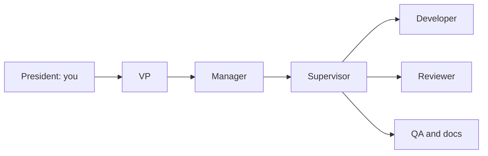

<p align="center">
  <picture>
    <source media="(prefers-color-scheme: dark)" srcset="docs/discovery/assets/plenipo-horizontal-on-dark.png">
    
  </picture>
</p>

<h1 align="center">Your AI workforce. One place to run it.</h1>

<p align="center">
  A local-first Windows desktop app for organizing AI workers across<br>
  <strong>Claude Code · Codex · Grok · Kimi · Ollama</strong>.<br>
  Give a team an objective. Choose its models and permissions. Review what happened.
</p>

<p align="center">
  <a href="https://github.com/Seckcey/plenipo/releases/latest"><strong>Download for Windows</strong></a> ·
  <a href="https://plenipo.8westit.com">Website</a> ·
  <a href="docs/development/setup.md">Build from source</a> ·
  <a href="docs/faq.md">FAQ</a> ·
  <a href="https://github.com/Seckcey/plenipo/discussions">Community</a>
</p>

<p align="center">
  <a href="https://github.com/Seckcey/plenipo/actions/workflows/ci.yml"></a>
  <a href="https://github.com/Seckcey/plenipo/releases/latest"></a>
  <a href="LICENSE"></a>
  
</p>

## Meet your team

Plenipo is for developers and small teams who want to coordinate several AI tools without
manually carrying every handoff between them. Organize departments and projects, assign a
Supervisor, and bring in workers for implementation, review, testing, and documentation.
You stay in charge of the permissions and approvals.

<p align="center">
  <a href="docs/discovery/assets/organization-v1.7.0.png"></a>
</p>

_Real app capture from the v1.7.0 development acceptance run, using synthetic test data.
The published v1.6.0 installer has an earlier appearance. [Screenshot provenance](docs/discovery/README.md)._

## Start here

**Windows 11 x64.** Open the [latest release](https://github.com/Seckcey/plenipo/releases/latest),
download its `Plenipo_<version>_x64-setup.exe` asset, and run the per-user installer.
Read that release's notes for changes, known limits, and installation details.

1. Install and sign in to at least one [supported AI tool](docs/development/setup.md#3-ai-tools-claude-code-codex-grok-kimi-and-ollama-optional).
2. In Plenipo, open **AI tools** and choose **Re-check**. Confirm the tool is **Ready**.
3. Create a department and project in **Organization**, add roles, and review their permissions.
4. Give a Supervisor a small objective, then follow its work and review approval requests.

Try: “Review this project's README and report unclear setup steps. Do not change files.”
Use a role with read-only permissions for that first run.

> **Release status — checked September 27, 2026:**
> [v1.6.0](https://github.com/Seckcey/plenipo/releases/tag/v1.6.0) is the latest published installer.
> The main branch contains v1.9.0 development work. A merged version bump is not a published release.

## What you can do

| Your goal                             | How Plenipo helps                                                                                                                    |
| ------------------------------------- | ------------------------------------------------------------------------------------------------------------------------------------ |
| Delegate a development task           | A Supervisor coordinates roles such as Developer, Code Reviewer, QA Engineer, and Documentation Writer.                              |
| Choose the right AI tool for each job | Set model preferences and effort by role, with explained model selection and review-provider policies.                               |
| Keep access deliberate                | Give roles permissions to read, change, run, or use git. Supported actions go through Guard and approval rules.                      |
| Work on websites                      | Use Plenipo's separate Edge or Chrome profile, allowed sites, approval cards, and owner takeover.                                    |
| Inspect your servers                  | Configure Linux/Unix SSH servers, pin their identities, and decide which commands roles may use. Production commands ask every time. |
| Understand the result                 | Review local task history, model choices, approvals, changes, tests, and findings in the Ledger and Activity trail.                  |

Browser, desktop, and SSH controls include **Stop all** and takeover/disconnect controls.
SSH starts off. Sending, buying, and signing in ask by default; Settings switches can allow them
without asking on allowed websites. Read [permissions and known limits](docs/faq.md#what-can-a-worker-do-without-asking)
before granting access.

## Your tools, your sign-ins

| AI tool     | Current integration                                                           |
| ----------- | ----------------------------------------------------------------------------- |
| Claude Code | Native Windows tool, signed in with your Claude account                       |
| Codex       | Native tool from the Codex package, signed in with ChatGPT                    |
| Grok        | Grok Build, signed in with its supported subscription                         |
| Kimi        | Kimi Code, signed in with its subscription; file access goes through Plenipo  |
| Ollama      | Signed-in **cloud models**, text conversations only; no file or command tools |

Plenipo uses account sign-ins and rejects API-key authentication. Provider plans, usage limits,
and availability still apply. [Installation and adapter details](docs/development/setup.md#3-ai-tools-claude-code-codex-grok-kimi-and-ollama-optional).

**Local-first means local control and records.** AI requests and task context still go to the
connected providers. This is not an offline-inference app. [Data and privacy FAQ](docs/faq.md#is-it-offline-does-my-work-stay-on-my-pc).

## How the organization works



You set the outcome. Leads pass work down to a project team. Workers act within their role's
permissions and supported tools, and hand back a result you can review. Development objectives
use their own working copies and branches. Titles can be personalized without changing roles.

## Free today; editions planned

The published v1.6.0 app has **no license check or edition limits**. The proposed Free/Pro split,
including subscription pricing and business departments, is a plan for a future release.
See [Free and Pro](docs/editions.md) for the full proposal. AI provider subscriptions are separate.

From v1.9.0, every copy (Free and Pro alike) checks Plenipo's GitHub Releases once a day for a
new version and tells you when one is ready. The check sends nothing about you or your work, and
nothing installs until you choose **Install now** ([ADR-037](docs/adr/ADR-037-updates.md), updates).

Plenipo is **source-available under the [Elastic License 2.0](LICENSE)**. Read the license for
its permissions and restrictions and [CONTRIBUTING.md](CONTRIBUTING.md#how-contributions-are-licensed)
for contribution terms.

## Build from source

Install the [Windows prerequisites](docs/development/setup.md#1-prerequisites) first, including
C++ Build Tools, the pinned Rust toolchain, Node.js, pnpm, and WebView2.

```powershell
git clone https://github.com/Seckcey/plenipo.git
cd plenipo
corepack enable
pnpm install --frozen-lockfile
pnpm dev
```

No API keys, provider login, or `.env` file is needed to build and open the app.
Running workers requires a supported signed-in tool. Windows 11 x64 is the product target;
Linux is used for development/tests, and macOS is not a current target.

## Help shape Plenipo

Useful first contributions are a reproducible Windows bug report, a clearer setup step, or a
sanitized real-app screenshot. Browse [open issues](https://github.com/Seckcey/plenipo/issues)
and discuss larger changes before starting. [CONTRIBUTING.md](CONTRIBUTING.md) explains the checks,
project conventions, and licensing terms.

- [Get help](SUPPORT.md) or [ask the community](https://github.com/Seckcey/plenipo/discussions).
- [Report a bug](https://github.com/Seckcey/plenipo/issues/new?template=bug_report.yml).
- [Read the roadmap](docs/roadmap.md), including what is published, merged, planned, or proposed.
- **Security concern:** read [SECURITY.md](SECURITY.md) first. Do not publish sensitive details in an issue or discussion.
- Star the repository if you want to find it again; use **Watch → Custom → Releases** for release notifications.

## Documentation

| For users                                       | For contributors                                        |
| ----------------------------------------------- | ------------------------------------------------------- |
| [FAQ](docs/faq.md)                              | [Architecture](docs/architecture/overview.md)           |
| [Setup and AI tools](docs/development/setup.md) | [Add an AI tool](docs/development/adding-an-ai-tool.md) |
| [Support](SUPPORT.md)                           | [Configuration](docs/development/configuration.md)      |
| [Roadmap](docs/roadmap.md)                      | [Decision records](docs/adr/README.md)                  |
| [Edition plan](docs/editions.md)                | [Phase acceptance evidence](docs/phases/)               |
| [Security policy](SECURITY.md)                  | [Full rollout plan](ROLLOUT_PLAN.md)                    |

<details>
<summary><strong>Stack, commands, and repository layout</strong></summary>

## Stack

| Layer            | Technology                   |
| ---------------- | ---------------------------- |
| Desktop shell    | Tauri 2                      |
| UI               | React 19 + TypeScript + Vite |
| Privileged core  | Rust (stable)                |
| Package managers | pnpm (JS), Cargo (Rust)      |
| Primary target   | Windows 11 (NSIS installer)  |

## Common commands

| Command                                                 | What it does                                                 |
| ------------------------------------------------------- | ------------------------------------------------------------ |
| `pnpm dev`                                              | Run the desktop app in development mode                      |
| `pnpm build`                                            | Build the release app and Windows installer                  |
| `pnpm check`                                            | Versions, format, lint, typecheck, frontend tests            |
| `pnpm test`                                             | Frontend unit tests (Vitest)                                 |
| `pnpm typecheck`                                        | TypeScript typecheck for all packages                        |
| `pnpm lint`                                             | ESLint                                                       |
| `pnpm format`                                           | Prettier (write)                                             |
| `pnpm bindings`                                         | Regenerate TypeScript DTOs from Rust (`packages/types`)      |
| `pnpm e2e`                                              | End-to-end tests against the release build (see setup guide) |
| `cargo test --workspace`                                | Rust unit tests                                              |
| `cargo clippy --workspace --all-targets -- -D warnings` | Rust lint                                                    |
| `cargo fmt --all`                                       | Rust format                                                  |

## Repository layout

```
apps/desktop/            React + TypeScript UI (Vite)
apps/desktop/src-tauri/  Tauri 2 Rust backend: typed command boundary, capabilities
crates/core/             Plenipo Core: provider-neutral domain types and shared DTOs
crates/ledger/           Plenipo Ledger: SQLite system of record, migrations, event trail
crates/liaison/          Plenipo Liaison: handoff protocol, context packets, replies between
                         workers
crates/runtime/          Plenipo Runtime: process supervisor, launch profiles, policy,
                         agent runtime adapters (Claude Code, Codex, Grok and Kimi over ACP,
                         Ollama) and sessions
crates/workforce/        Plenipo Workforce: organization engine (positions, teams, oversight,
                         role templates), live snapshot, role routing for Liaison
crates/router/           Plenipo Router: model registry, role model policies, explained
                         choice of AI tool and model, usage limits
crates/guard/            Plenipo Guard: permission registry and sets, policy engine, folder
                         confinement, command rules, sensitive actions, secret redaction,
                         servers and the kinds of commands on them
crates/capabilities/     Capability broker: grants, Plenipo's tool server and relay, file,
                         program, git, and GitHub tools, working copies (a branch per
                         objective), approvals, Vault (OS credential store), Plenipo's
                         browser, screenshots, the screen, mouse, and keyboard, SSH to the
                         owner's servers, and the control center (sign, Stop, Take over,
                         Disconnect)
packages/types/          TypeScript DTOs generated from Rust (do not hand-edit)
tests/e2e/               End-to-end tests driving the real app via tauri-driver
docs/architecture/       Architecture overview
docs/adr/                Architecture Decision Records
docs/brand/              Logo, colors, and the social preview artwork
docs/development/        Setup, configuration, versioning
docs/discovery/          Repository presentation assets and validation
docs/images/             Screenshot contribution guide
docs/phases/             Phase checklists and acceptance reports
scripts/                 Repository tooling
```

Further crates from the plan are added when the phase that needs them begins — see
[ADR-004](docs/adr/ADR-004-repository-layout.md).

</details>

<details>
<summary><strong>Development history</strong></summary>

## What's new

The entries below describe development milestones. See [GitHub Releases](https://github.com/Seckcey/plenipo/releases) for published installers.

<details>
<summary><strong>v1.9.0 — Installs, updates, and recovers cleanly</strong> (Phase 13)</summary>

Plenipo lives in the tray: closing the window keeps the work going (Settings → **Start and close**
has the choices, and **Start Plenipo with Windows**, off to begin with). Opening it again shows the
one already running. If Plenipo or Windows stops unexpectedly, the next start says what happened
and which tasks stopped, with **Run again** or **Leave stopped**. The Ledger is backed up every day
and before each new version; Diagnostics can **Restore** a backup and **Save a diagnostics file**.
Plenipo checks for a new version once a day and installs it only when you choose **Install now**,
and only if 8 West signed it. Uninstalling keeps your data unless you tick the box to delete it.

[Release notes](docs/releases/v1.9.0.md) · [ADR-036](docs/adr/ADR-036-background-work.md)
(background work) · [ADR-037](docs/adr/ADR-037-updates.md) (updates)

</details>

<details>
<summary><strong>v1.8.0 — Home, a page for everything, your terminal, and notices</strong> (Phase 12)</summary>

Plenipo opens on **Home**, where Pip says how your company is doing: what waits for you, what's
stuck, each department's health, the objectives going, who's working, and what just finished.
Every department, project, worker, and task has its own page, with **Back**. The **Terminal**
panel (Ctrl+`) lets you type on this PC or on your servers (the server's ID is checked first), and
a watch tab shows each worker's server commands as they run, with **Stop** and **Disconnect**.
Windows **pop-up notices** tell you when something needs you. **Settings** is one list of
sections. The older pages use the same building blocks, and Plenipo wears its new logo and Pip.

[Release notes](docs/releases/v1.8.0.md) · [ADR-031](docs/adr/ADR-031-terminal-panel.md) (the
terminal panel) · [ADR-033](docs/adr/ADR-033-pages-notices-settings.md) (Home, the pages, notices,
and Settings)

</details>

<details>
<summary><strong>v1.7.0 — A new look</strong> (Phase 12A)</summary>

Every page now sits in one frame and uses one set of building blocks: a left strip with each
section's icon and its name under it, a top bar with **Showing** (your whole organization, a
department, or a project), light or dark, and a bell for requests waiting for you, and notices
above the page. Text is smaller and tighter, so more fits. Status always has a word and its own
mark shape, never color alone. Diagnostics → **Open the gallery** shows every building block in
both themes, with your real departments and projects and their last 24 hours of activity from the
Ledger. What each page does is unchanged.

[Release notes](docs/releases/v1.7.0.md) · [ADR-030](docs/adr/ADR-030-design-system.md) (one
design system for every screen) · [Design system](docs/design/design-system.md)

</details>

<details>
<summary><strong>v1.6.0 — Servers</strong> (Phase 11)</summary>

Workers can now work on your servers over SSH — checking status and logs, restarting services,
and deploying — only on the servers you add in **Settings → Servers**. Each server has a name, its
address, how Plenipo signs in (a key or password kept in Windows Credential Manager, or your own
SSH agent; workers never see them), its server ID, which you check and pin when you add it, and
whether it is a test, staging, or **production** server (production is red everywhere).
You choose which roles may use it, the kinds of commands it allows, and its folders.

Plenipo checks each server's ID before it signs in; if it ever changes, the work is blocked and
you are told. On production, every command waits for your approval, and deleting, wiping, or
shutting down is off unless you turn it on. Workers never reach other computers from a server.
A sign on every page shows who is connected to which server, with **Disconnect** and **Stop all**,
and every command and its output are in the Activity trail. The new **Operations Engineer** role
does this work.

It starts off: turn on **Settings → Switches → Remote computers (SSH)** when you are ready.
Lessons from a task that used a server always wait for you. Servers are in the Free edition.

[Release notes](docs/releases/v1.6.0.md) · [ADR-025](docs/adr/ADR-025-servers-over-ssh.md)
(servers over SSH, through Guard) · [ADR-026](docs/adr/ADR-026-ssh-built-in.md) (SSH built into
Plenipo, not Windows' ssh.exe)

</details>

<details>
<summary><strong>v1.5.0 — Kimi joins the AI tools</strong></summary>

Moonshot AI's Kimi Code, on your own Kimi subscription. Kimi's own tools cannot be switched off,
so every file it reads or writes goes through Plenipo and Guard, inside the project folder; its own
command line is always refused, and it never runs in its auto or yolo modes.
[Release notes](docs/releases/v1.5.0.md) ·
[ADR-027](docs/adr/ADR-027-acp-file-access-through-plenipo.md) (Kimi over ACP, with its file reads
and writes going through Plenipo)

</details>

<details>
<summary><strong>v1.4.0 — Switches in Settings, and workers that learn from their work</strong></summary>

**Settings → Switches** turns Plenipo's browser and the screen, mouse, and keyboard on or off for
every worker (the screen starts off). It also decides whether workers may send, buy, or press Sign
in **without asking you** on your allowed websites; all three start off, so workers ask. When a
website shows a CAPTCHA, the worker hands it to you and waits while you solve it; workers never try
one. Screenshots in the Activity trail can be switched off, and approval cards keep theirs.

Workers now write down short **lessons** from their work. You keep, edit, or discard each one on the
Approvals page, or let a role **learn on its own**, and kept lessons go to that role's later
workers. Lessons from tasks that used websites or your screen always ask you first.

[Release notes](docs/releases/v1.4.0.md) · [ADR-023](docs/adr/ADR-023-settings-switches.md)
(on/off switches in Settings) · [ADR-024](docs/adr/ADR-024-workers-learn-from-work.md) (workers
learn from their work)

</details>

<details>
<summary><strong>v1.3.0 — Plenipo's browser, and the screen, mouse, and keyboard</strong> (Phase 10)</summary>

Workers can do tasks on websites that have no official connection — in **Plenipo's own browser**,
never yours: it has its own profile, so your sign-ins and saved passwords are never used.
**Settings → Permissions → Websites** says which sites workers may open, which never, and whether
others ask you first. Submitting a form, buying, signing in, and sending anything always wait for
your approval, with a screenshot of the page. Workers never type passwords or secrets, and never
get past a CAPTCHA. As a last resort, a worker you allow can see the screen and use the mouse and
keyboard, and taking control asks you every time. Whenever a worker uses the browser or the
desktop, a sign on every page says so, with **Take over** and **Stop all**; the Windows tray has
the same Stop. Every step is in the Activity trail with its screenshot.

Every role now also knows its job — what it does, what it hands back, its limits, and when to ask
for help — and you can write the same for your own roles.

[Release notes](docs/releases/v1.3.0.md) · [ADR-020](docs/adr/ADR-020-browser-and-computer-use.md)
(Plenipo's browser and computer use, through Guard) ·
[ADR-019](docs/adr/ADR-019-role-working-instructions.md) (every role knows its job)

</details>

<details>
<summary><strong>v1.2.0 — Ollama's cloud models join the AI tools</strong></summary>

Ollama's cloud models, through its service on your PC.
[Release notes](docs/releases/v1.2.0.md) ·
[ADR-017](docs/adr/ADR-017-ollama-cloud-models.md) (Ollama's cloud models through its service)

</details>

<details>
<summary><strong>v1.1.0 — Grok joins the AI tools</strong></summary>

xAI's Grok Build, run over ACP. [Release notes](docs/releases/v1.1.0.md) ·
[ADR-015](docs/adr/ADR-015-acp-ai-tools.md) (running AI tools over ACP)

</details>

<details>
<summary><strong>v1.0.0 — The Development department</strong> (Phase 8, the first full release)</summary>

Tell Development what you want — "implement the login page in Website and get it ready for review" —
and it gets done without you opening Claude Code or Codex. **Projects → Set up a Development
project** creates the department with its VP, the project with its Supervisor, and a team: a
developer, a code reviewer, a QA engineer, and a documentation writer, on both AI tools. The team
works on a new branch in its own working copy of your project folder (your own copy is never
changed): implement, review, fix, test, and — when you ask — open a draft pull request on GitHub,
which waits for your approval. The **result** is Plenipo's own record of all of it.

[Release notes](docs/releases/v1.0.0.md) ·
[ADR-016](docs/adr/ADR-016-development-department.md) (Development department)

</details>

<details>
<summary><strong>v0.8.0 — Workers can use your computer, with your permission</strong> (Phase 7)</summary>

**Settings → Permissions** gives each role a permission set (read files, change files, run
programs, save to git…, each Allowed, Ask me, or Blocked), lets a project or department narrow it,
lists the programs workers may run without asking and the files they may never open, and keeps
secrets in Windows Credential Manager. Anything outside a worker's permissions is blocked and
shown; sensitive actions stop for your approval with a card that says exactly what will run. The
**Approvals** page lets you approve, deny, or revoke at once.

[Release notes](docs/releases/v0.8.0.md) ·
[ADR-013](docs/adr/ADR-013-guard-capability-broker.md) (Guard, capability broker, and human
approval)

</details>

<details>
<summary><strong>v0.7.0 — Model policy and role routing</strong> (Phase 6)</summary>

**Settings → AI models** says which AI model each role's workers get: list your models, set how hard
each one thinks, and give each role its first choice, backups, required abilities, AI companies it
never uses, and reviews by a different company. A usage limit never moves work to another AI company
unless you allow it.

[Release notes](docs/releases/v0.7.0.md) ·
[ADR-011](docs/adr/ADR-011-model-policy-routing.md) (Router: model registry, role policies, routing)

</details>

<details>
<summary><strong>v0.6.1 — Workforce and organization engine</strong> (Phase 5)</summary>

The **Organization** view becomes a live map: create departments and projects, drag roles from the
hire palette onto a lead, drag positions to change who they report to or to make them a team's
reviewer, QA evaluator, or security auditor, and give a Supervisor an objective.

[Release notes](docs/releases/v0.6.1.md) ·
[ADR-009](docs/adr/ADR-009-workforce.md) (Workforce organization engine and topology canvas) ·
[ADR-010](docs/adr/ADR-010-plain-titles.md) (plain words, chain of command, choosable ranks)

</details>

Older releases: [`docs/releases/`](docs/releases/). Phase 9 (Sales) is postponed — a Sales
department on HubSpot comes later
([ADR-018](docs/adr/ADR-018-sales-on-hubspot-no-paperclip.md)).

</details>

<details>
<summary><strong>Why “Plenipo”?</strong></summary>

Plenipo — _PLEN-ih-poh_ — is short for _plenipotentiary_: a representative entrusted to act
within an agreed brief. That is the idea behind the workforce: a clear objective, useful
authority, and boundaries you control. The little robot in the logo is Pip.

</details>

© 2026 8 West Ventures, LLC.
