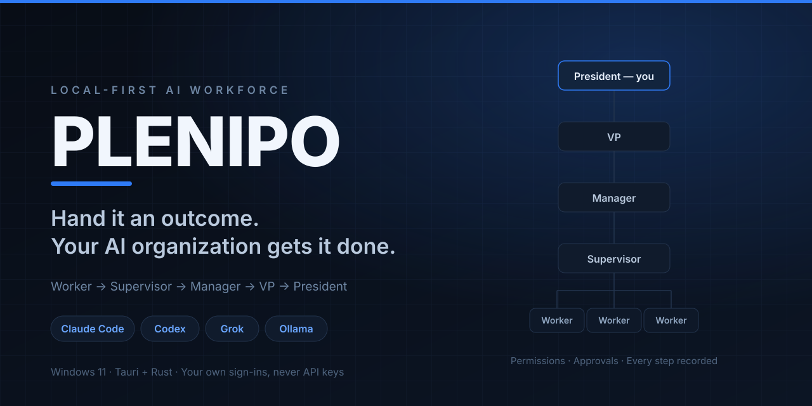
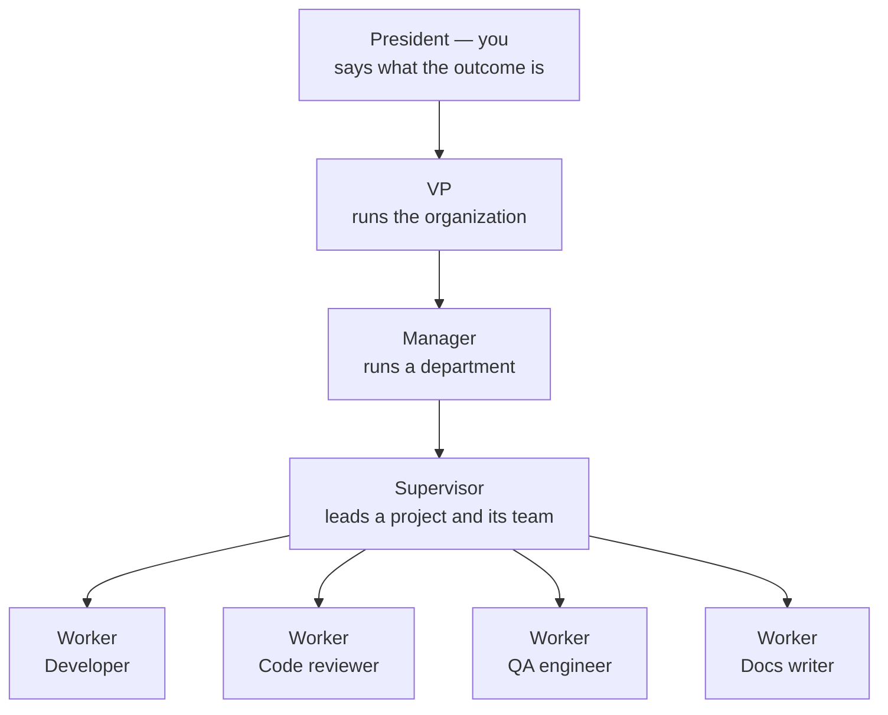

<p align="center">
  
</p>

<p align="center">
  <strong>Hand it an outcome. Your AI organization gets it done.</strong><br>
  A Windows desktop app that runs a whole AI workforce on your own PC — on your own Claude Code,
  Codex, Grok, Kimi, and Ollama sign-ins. No API keys, no cloud, no per-token bill.
</p>

<p align="center">
  <a href="https://github.com/Seckcey/plenipo/actions/workflows/ci.yml"></a>
  <a href="https://github.com/Seckcey/plenipo/releases/latest"></a>
  <a href="LICENSE"></a>
  
  <a href="https://github.com/Seckcey/plenipo/stargazers"></a>
</p>

<p align="center">
  <a href="https://github.com/Seckcey/plenipo/releases/latest"><strong>Download for Windows</strong></a>
  ·
  <a href="docs/development/setup.md">Build from source</a>
  ·
  <a href="docs/editions.md">Free and Pro</a>
  ·
  <a href="ROLLOUT_PLAN.md">Roadmap</a>
</p>

---

## What Plenipo is

Most AI coding tools give you one assistant in one window. You are still the one splitting the work
up, carrying answers between tools, and remembering where everything stands.

Plenipo gives you an **organization** instead. You say what you want. A VP hands it to a Manager,
who hands it to a Supervisor, whose team of workers does the job — implement, review, test,
document — and hands back a result you can read. Everything runs on your own computer, on AI tools
you already pay for, and every step is written down.

You are the President. You approve what matters and stay out of the rest.

## Where the name comes from

**Plenipo** — _PLEN-ih-poh_ — is short for **plenipotentiary**: a diplomat sent abroad with full
power to negotiate and sign on behalf of a government, without going home for approval on every
point.

That is the job Plenipo gives an AI worker. A Supervisor hands it an objective and it acts with real
authority — it writes files, runs programs, commits to a branch, opens a browser. It does not stop
to ask about every step, because a worker that asks about everything costs you more attention than
doing the job yourself.

And like a real plenipotentiary, its authority has edges. It is given a brief — its job, what it
hands back, its limits, and when to come ask. It works inside its own folder. And the things no
government ever delegates — money, passwords, publishing, anything that cannot be taken back — come
back to the President for a signature.

Full power, clearly bounded. That is the whole idea.

## What it does

- **Builds you an org chart that works.** Create departments and projects, drag roles onto a lead to
  build a team, and give a Supervisor an objective. Its workers show up under it while they work and
  leave when they are done.
- **Runs on the AI tools you already have.** Claude Code, Codex, Grok, Kimi, and Ollama, on your
  own sign-ins. Plenipo never uses API keys, so there is no per-token bill for any of this.
- **Picks the right model for each role.** Say which models a role may use, in what order, how hard
  they should think, and whether reviews must come from a different AI company. Plenipo shows you
  the model every worker would get, and why.
- **Keeps workers on a leash.** Each role gets a permission set — read files, change files, run
  programs, save to git — set to Allowed, Ask me, or Blocked. Workers stay inside their project's
  folder. Secrets live in the Windows Credential Manager, where workers never see them.
- **Stops for your approval on anything that matters.** Deploying, DNS, passwords, payments,
  publishing, running as administrator, submitting a form, buying, signing in, sending anything —
  each one waits, with a card that says exactly what will run, and a screenshot when it happens in a
  browser. On websites you trust, **Settings → Switches** can let workers send, buy, or press Sign in
  without asking; all three start off.
- **Does the work on websites too.** In **Plenipo's own browser**, never yours: Microsoft Edge or
  Google Chrome, your pick, with its own profile, so your sign-ins and saved passwords are never
  touched. You choose which sites workers may open.
  Workers never type passwords and never try a CAPTCHA: they hand it to you to solve, and when a site
  needs you signed in, you sign in yourself.
- **Gets better at your work.** Workers write down short lessons from what they did. You keep the
  good ones (or let a role learn on its own), and that role's later workers follow them.
- **Works on your servers, carefully.** An Operations Engineer can check a server, read its logs,
  restart a service, or deploy — only on the servers you add in **Settings → Servers**, and only
  after you have checked and pinned each server's ID. Keys and passwords stay in the Windows
  Credential Manager or your SSH agent. On a **production** server every command waits for you,
  and deleting, wiping, or shutting down is off unless you turn it on. It starts switched off
  (**Settings → Switches → Remote computers (SSH)**).
- **Writes everything down.** Every task, who did it on which AI model, files changed, tests and
  whether they passed, the review and its open findings, the branch and pull request, and every
  approval — in a local record you own.
- **Gives you the kill switch.** Whenever a worker is using the browser, the desktop, or a server,
  a sign on the page says so, with **Take over** (or **Disconnect**) and **Stop all**. The Windows
  tray has the same Stop, and **Settings → Switches** turns the browser, the screen, mouse, and
  keyboard, or remote computers (SSH) off for every worker.

## How it works



1. **You give an objective** to a department or a project — "implement the login page in Website and
   get it ready for review."
2. **It gets handed down** the chain of command until it reaches a Supervisor with a team that can
   do it.
3. **The team works** on a new branch, in its own copy of your project folder. Your own copy is
   never touched.
4. **You get a result**: what was done, by whom, on which model, what passed, what is still open,
   and anything waiting on your approval.

Ranks are yours to rename — **Settings → Personalization → Titles** swaps them for a U.S. military
branch, or the Mafia. Only the names change.

## Screenshots

Coming with the next release. If you are running Plenipo already,
[screenshots are the most useful thing you can contribute](docs/images/README.md).

<!-- Uncomment each block below once the file exists — see docs/images/README.md.

<p align="center"></p>
<p align="center"><em>The Organization view — a live map of your workforce.</em></p>

<p align="center"></p>
<p align="center"><em>Nothing sensitive happens without this card.</em></p>

<p align="center"></p>
<p align="center"><em>Every role gets exactly the permissions it needs.</em></p>

-->

## Free and Pro

| Edition  | Price                                          | What you get                                                                                                                                                 |
| -------- | ---------------------------------------------- | ------------------------------------------------------------------------------------------------------------------------------------------------------------ |
| **Free** | Free, no card, no account                      | One department, one project, three workers at a time, and the whole Development department. All five AI tools, and every safety feature.                     |
| **Pro**  | **$9/month**, or **$99/year** — one month free | Unlimited departments, projects, and workers, plus the business departments — Sales on HubSpot and what follows it — and workers that learn from their work. |

Nothing that keeps a worker in bounds is ever behind the paid tier. Full breakdown:
[`docs/editions.md`](docs/editions.md).

> Releases up to v1.6.0 have no limits at all — everything is unlocked while the split is being
> built. When it ships, a Pro copy will check its subscription with 8 West about once a week,
> sending only a license key id and a version number. A Free copy never checks in at all, and your
> work never leaves your PC either way —
> [ADR-022](docs/adr/ADR-022-subscription-and-license-check.md).

## Quick start

Prerequisites and a step-by-step Windows guide: [`docs/development/setup.md`](docs/development/setup.md).

```powershell
git clone https://github.com/Seckcey/plenipo.git
cd plenipo
corepack enable
pnpm install
pnpm dev          # run the desktop app with hot reload
```

No API keys, provider logins, or `.env` file are needed to build or launch. To run workers, install
and sign in to at least one of Claude Code, Codex, Grok, Kimi, and Ollama — see the
[setup guide](docs/development/setup.md#3-ai-tools-claude-code-codex-grok-kimi-and-ollama-optional).

Prefer not to build it? [Download the latest Windows installer](https://github.com/Seckcey/plenipo/releases/latest).

## What's new

Plenipo is built phase by phase. Current version: **v1.6.0**.

<details>
<summary><strong>v1.6.0 — Servers</strong> (Phase 11)</summary>

Workers can now work on your servers over SSH — checking status and logs, restarting services,
and deploying — only on the servers you add in **Settings → Servers**. Each server has a name, its
address, how Plenipo signs in (a key or password kept in Windows Credential Manager, or your own
SSH agent; workers never see them), its server ID, which you check and pin when you add it, and
whether it is a test, staging, or **production** server (production is red everywhere).
You choose which roles may use it, the kinds of commands it allows, and its folders.

Plenipo checks each server's ID before it signs in; if it ever changes, the work is blocked and
you are told. On production, every command waits for your approval, and deleting, wiping, or
shutting down is off unless you turn it on. Workers never reach other computers from a server.
A sign on every page shows who is connected to which server, with **Disconnect** and **Stop all**,
and every command and its output are in the Activity trail. The new **Operations Engineer** role
does this work.

It starts off: turn on **Settings → Switches → Remote computers (SSH)** when you are ready.
Lessons from a task that used a server always wait for you. Servers are in the Free edition.

[Release notes](docs/releases/v1.6.0.md) · [ADR-025](docs/adr/ADR-025-servers-over-ssh.md)
(servers over SSH, through Guard) · [ADR-026](docs/adr/ADR-026-ssh-built-in.md) (SSH built into
Plenipo, not Windows' ssh.exe)

</details>

<details>
<summary><strong>v1.5.0 — Kimi joins the AI tools</strong></summary>

Moonshot AI's Kimi Code, on your own Kimi subscription. Kimi's own tools cannot be switched off,
so every file it reads or writes goes through Plenipo and Guard, inside the project folder; its own
command line is always refused, and it never runs in its auto or yolo modes.
[Release notes](docs/releases/v1.5.0.md) ·
[ADR-027](docs/adr/ADR-027-acp-file-access-through-plenipo.md) (Kimi over ACP, with its file reads
and writes going through Plenipo)

</details>

<details>
<summary><strong>v1.4.0 — Switches in Settings, and workers that learn from their work</strong></summary>

**Settings → Switches** turns Plenipo's browser and the screen, mouse, and keyboard on or off for
every worker (the screen starts off). It also decides whether workers may send, buy, or press Sign
in **without asking you** on your allowed websites; all three start off, so workers ask. When a
website shows a CAPTCHA, the worker hands it to you and waits while you solve it; workers never try
one. Screenshots in the Activity trail can be switched off, and approval cards keep theirs.

Workers now write down short **lessons** from their work. You keep, edit, or discard each one on the
Approvals page, or let a role **learn on its own**, and kept lessons go to that role's later
workers. Lessons from tasks that used websites or your screen always ask you first.

[Release notes](docs/releases/v1.4.0.md) · [ADR-023](docs/adr/ADR-023-settings-switches.md)
(on/off switches in Settings) · [ADR-024](docs/adr/ADR-024-workers-learn-from-work.md) (workers
learn from their work)

</details>

<details>
<summary><strong>v1.3.0 — Plenipo's browser, and the screen, mouse, and keyboard</strong> (Phase 10)</summary>

Workers can do tasks on websites that have no official connection — in **Plenipo's own browser**,
never yours: it has its own profile, so your sign-ins and saved passwords are never used.
**Settings → Permissions → Websites** says which sites workers may open, which never, and whether
others ask you first. Submitting a form, buying, signing in, and sending anything always wait for
your approval, with a screenshot of the page. Workers never type passwords or secrets, and never
get past a CAPTCHA. As a last resort, a worker you allow can see the screen and use the mouse and
keyboard, and taking control asks you every time. Whenever a worker uses the browser or the
desktop, a sign on every page says so, with **Take over** and **Stop all**; the Windows tray has
the same Stop. Every step is in the Activity trail with its screenshot.

Every role now also knows its job — what it does, what it hands back, its limits, and when to ask
for help — and you can write the same for your own roles.

[Release notes](docs/releases/v1.3.0.md) · [ADR-020](docs/adr/ADR-020-browser-and-computer-use.md)
(Plenipo's browser and computer use, through Guard) ·
[ADR-019](docs/adr/ADR-019-role-working-instructions.md) (every role knows its job)

</details>

<details>
<summary><strong>v1.2.0 — Ollama's cloud models join the AI tools</strong></summary>

Ollama's cloud models, through its service on your PC.
[Release notes](docs/releases/v1.2.0.md) ·
[ADR-017](docs/adr/ADR-017-ollama-cloud-models.md) (Ollama's cloud models through its service)

</details>

<details>
<summary><strong>v1.1.0 — Grok joins the AI tools</strong></summary>

xAI's Grok Build, run over ACP. [Release notes](docs/releases/v1.1.0.md) ·
[ADR-015](docs/adr/ADR-015-acp-ai-tools.md) (running AI tools over ACP)

</details>

<details>
<summary><strong>v1.0.0 — The Development department</strong> (Phase 8, the first full release)</summary>

Tell Development what you want — "implement the login page in Website and get it ready for review" —
and it gets done without you opening Claude Code or Codex. **Projects → Set up a Development
project** creates the department with its VP, the project with its Supervisor, and a team: a
developer, a code reviewer, a QA engineer, and a documentation writer, on both AI tools. The team
works on a new branch in its own working copy of your project folder (your own copy is never
changed): implement, review, fix, test, and — when you ask — open a draft pull request on GitHub,
which waits for your approval. The **result** is Plenipo's own record of all of it.

[Release notes](docs/releases/v1.0.0.md) ·
[ADR-016](docs/adr/ADR-016-development-department.md) (Development department)

</details>

<details>
<summary><strong>v0.8.0 — Workers can use your computer, with your permission</strong> (Phase 7)</summary>

**Settings → Permissions** gives each role a permission set (read files, change files, run
programs, save to git…, each Allowed, Ask me, or Blocked), lets a project or department narrow it,
lists the programs workers may run without asking and the files they may never open, and keeps
secrets in Windows Credential Manager. Anything outside a worker's permissions is blocked and
shown; sensitive actions stop for your approval with a card that says exactly what will run. The
**Approvals** page lets you approve, deny, or revoke at once.

[Release notes](docs/releases/v0.8.0.md) ·
[ADR-013](docs/adr/ADR-013-guard-capability-broker.md) (Guard, capability broker, and human
approval)

</details>

<details>
<summary><strong>v0.7.0 — Model policy and role routing</strong> (Phase 6)</summary>

**Settings → AI models** says which AI model each role's workers get: list your models, set how hard
each one thinks, and give each role its first choice, backups, required abilities, AI companies it
never uses, and reviews by a different company. A usage limit never moves work to another AI company
unless you allow it.

[Release notes](docs/releases/v0.7.0.md) ·
[ADR-011](docs/adr/ADR-011-model-policy-routing.md) (Router: model registry, role policies, routing)

</details>

<details>
<summary><strong>v0.6.1 — Workforce and organization engine</strong> (Phase 5)</summary>

The **Organization** view becomes a live map: create departments and projects, drag roles from the
hire palette onto a lead, drag positions to change who they report to or to make them a team's
reviewer, QA evaluator, or security auditor, and give a Supervisor an objective.

[Release notes](docs/releases/v0.6.1.md) ·
[ADR-009](docs/adr/ADR-009-workforce.md) (Workforce organization engine and topology canvas) ·
[ADR-010](docs/adr/ADR-010-plain-titles.md) (plain words, chain of command, choosable ranks)

</details>

Older releases: [`docs/releases/`](docs/releases/). Phase 9 (Sales) is postponed — a Sales
department on HubSpot comes later
([ADR-018](docs/adr/ADR-018-sales-on-hubspot-no-paperclip.md)).

## Stack

| Layer            | Technology                   |
| ---------------- | ---------------------------- |
| Desktop shell    | Tauri 2                      |
| UI               | React 19 + TypeScript + Vite |
| Privileged core  | Rust (stable)                |
| Package managers | pnpm (JS), Cargo (Rust)      |
| Primary target   | Windows 11 (NSIS installer)  |

## Common commands

| Command                                                 | What it does                                                 |
| ------------------------------------------------------- | ------------------------------------------------------------ |
| `pnpm dev`                                              | Run the desktop app in development mode                      |
| `pnpm build`                                            | Build the release app and Windows installer                  |
| `pnpm check`                                            | Versions, format, lint, typecheck, frontend tests            |
| `pnpm test`                                             | Frontend unit tests (Vitest)                                 |
| `pnpm typecheck`                                        | TypeScript typecheck for all packages                        |
| `pnpm lint`                                             | ESLint                                                       |
| `pnpm format`                                           | Prettier (write)                                             |
| `pnpm bindings`                                         | Regenerate TypeScript DTOs from Rust (`packages/types`)      |
| `pnpm e2e`                                              | End-to-end tests against the release build (see setup guide) |
| `cargo test --workspace`                                | Rust unit tests                                              |
| `cargo clippy --workspace --all-targets -- -D warnings` | Rust lint                                                    |
| `cargo fmt --all`                                       | Rust format                                                  |

## Repository layout

```
apps/desktop/            React + TypeScript UI (Vite)
apps/desktop/src-tauri/  Tauri 2 Rust backend: typed command boundary, capabilities
crates/core/             Plenipo Core: provider-neutral domain types and shared DTOs
crates/ledger/           Plenipo Ledger: SQLite system of record, migrations, event trail
crates/liaison/          Plenipo Liaison: handoff protocol, context packets, replies between
                         workers
crates/runtime/          Plenipo Runtime: process supervisor, launch profiles, policy,
                         agent runtime adapters (Claude Code, Codex, Grok and Kimi over ACP,
                         Ollama) and sessions
crates/workforce/        Plenipo Workforce: organization engine (positions, teams, oversight,
                         role templates), live snapshot, role routing for Liaison
crates/router/           Plenipo Router: model registry, role model policies, explained
                         choice of AI tool and model, usage limits
crates/guard/            Plenipo Guard: permission registry and sets, policy engine, folder
                         confinement, command rules, sensitive actions, secret redaction,
                         servers and the kinds of commands on them
crates/capabilities/     Capability broker: grants, Plenipo's tool server and relay, file,
                         program, git, and GitHub tools, working copies (a branch per
                         objective), approvals, Vault (OS credential store), Plenipo's
                         browser, screenshots, the screen, mouse, and keyboard, SSH to the
                         owner's servers, and the control center (sign, Stop, Take over,
                         Disconnect)
packages/types/          TypeScript DTOs generated from Rust (do not hand-edit)
tests/e2e/               End-to-end tests driving the real app via tauri-driver
docs/architecture/       Architecture overview
docs/adr/                Architecture Decision Records
docs/brand/              Logo, colors, and the social preview artwork
docs/development/        Setup, configuration, versioning
docs/images/             Screenshots used in this README
docs/phases/             Phase checklists and acceptance reports
scripts/                 Repository tooling
```

Further crates from the plan are added when the phase that needs them begins — see
[ADR-004](docs/adr/ADR-004-repository-layout.md).

## Documentation

- [Architecture overview](docs/architecture/overview.md)
- [Developer setup (Windows)](docs/development/setup.md)
- [Adding an AI tool](docs/development/adding-an-ai-tool.md)
- [Configuration conventions](docs/development/configuration.md)
- [Versioning](docs/development/versioning.md)
- [Architecture Decision Records](docs/adr/README.md)
- [Plain words: the words the app uses](docs/design/vocabulary.md)
- [Free and Pro](docs/editions.md)
- [Phase checklists and acceptance reports](docs/phases/)
- [Rollout plan](ROLLOUT_PLAN.md)

## Roadmap

Plenipo follows [`ROLLOUT_PLAN.md`](ROLLOUT_PLAN.md), phase by phase, each with a checklist and an
acceptance report in [`docs/phases/`](docs/phases/). Next up: **Phase 11A**, the Free and Pro
split and the license key ([ADR-021](docs/adr/ADR-021-editions-and-license.md)), then the Sales department on HubSpot
([ADR-018](docs/adr/ADR-018-sales-on-hubspot-no-paperclip.md)).

Have an opinion on what should come next?
[Open a discussion](https://github.com/Seckcey/plenipo/discussions) — the roadmap is not set in
stone.

## Contributing

Pull requests are welcome. [`CONTRIBUTING.md`](CONTRIBUTING.md) covers getting set up, the checks a
change has to pass, and the house rules — chief among them: **every word a person can see uses
plain, everyday language** ([`docs/design/vocabulary.md`](docs/design/vocabulary.md)).

Good first contributions: screenshots ([here is what is needed](docs/images/README.md)), a bug
report from your own Windows setup, or a fix for something in the
[open issues](https://github.com/Seckcey/plenipo/issues).

## Security

Plenipo runs AI workers with real permissions on a real computer, so security reports matter. Never
open a public issue for one — use [private reporting](https://github.com/Seckcey/plenipo/security).
The promises Plenipo makes, and what counts as a vulnerability, are in
[`SECURITY.md`](SECURITY.md).

## License

Plenipo is source-available under the [Elastic License 2.0](LICENSE). You may read, build, run,
change, and share it. You may not sell it to others as a hosted or managed service, or work around
its license-key checks. See [`docs/editions.md`](docs/editions.md) for Free and Pro, and
[ADR-021](docs/adr/ADR-021-editions-and-license.md) for why this license.

© 2026 8 West Ventures, LLC.

---

<p align="center">
  If the idea of an AI org chart on your own PC is interesting,
  <a href="https://github.com/Seckcey/plenipo">star the repo</a> — it is the clearest signal of what
  to build next.
</p>
