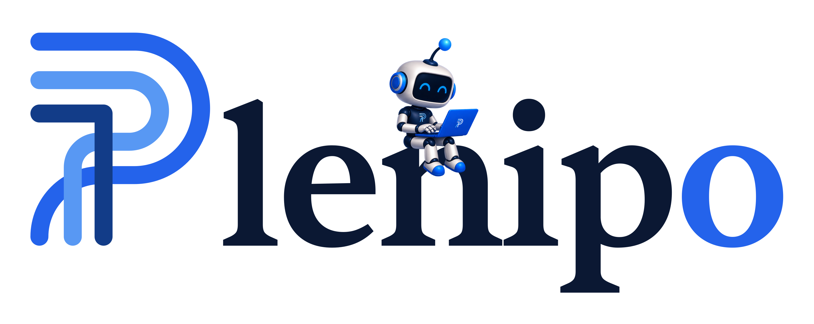
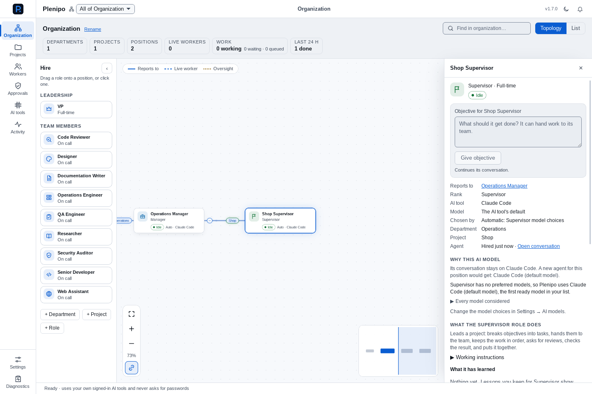
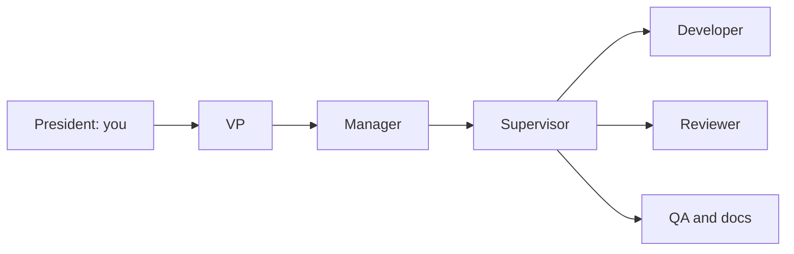

<p align="center">
  <picture>
    <source media="(prefers-color-scheme: dark)" srcset="docs/discovery/assets/plenipo-horizontal-on-dark.png">
    
  </picture>
</p>

<h1 align="center">Hire your AI team. Give it a goal.</h1>

<p align="center">
  Hire agents by role. A coordinator brings their work together across AI providers.<br>
  Start with Plenipo's suggested role policies, then adjust model choices and reasoning effort.<br>
  Follow the work in one Windows desktop workspace.
</p>

<p align="center">
  <a href="https://github.com/Seckcey/plenipo/releases/latest"><strong>Download for Windows</strong></a> ·
  <a href="https://plenipo.8westit.com">Website</a> ·
  <a href="docs/development/setup.md">Build from source</a> ·
  <a href="docs/faq.md">FAQ</a> ·
  <a href="https://github.com/Seckcey/plenipo/discussions">Community</a>
</p>

<p align="center">
  <a href="https://github.com/Seckcey/plenipo/actions/workflows/ci.yml"></a>
  <a href="https://github.com/Seckcey/plenipo/releases/latest"></a>
  <a href="LICENSE"></a>
  
</p>

## Meet your team

Start with the outcome you want and the roles needed to achieve it. Hire a developer,
reviewer, QA engineer, or writer, and give your Supervisor an objective. The Supervisor
delegates tasks, coordinates handoffs, and brings the team's results back together.

Workers can use different supported AI providers in the same project. Automatic agents follow
model policies: start with Plenipo's suggested role preferences, then set models and effort for
your organization, department, role, or agent. Unset effort uses the model or AI tool's default.
You control permissions and approvals, and can inspect why a model was chosen.

For example, hire a developer to build a services page and a reviewer to check it. Your policies
could assign Claude Code to the developer and Codex to the reviewer. Separate working copies,
owner terminals, read-only code Watch, test results, and task history support the work.

<p align="center">
  <a href="docs/discovery/assets/organization-v1.7.0.png"></a>
</p>

_Real app capture from a development acceptance run, using synthetic test data. The latest
release may look a little different. [Screenshot provenance](docs/discovery/README.md)._

## Start here

**Windows 11 x64.** Open the [latest release](https://github.com/Seckcey/plenipo/releases/latest),
download its `Plenipo_<version>_x64-setup.exe` asset, and run the per-user installer.
Read that release's notes for changes, known limits, and installation details.

1. Install and sign in to at least one [supported AI tool](docs/development/setup.md#3-ai-tools-claude-code-codex-grok-kimi-ollama-antigravity-and-github-copilot-optional).
2. In Plenipo, open **AI tools** and choose **Re-check**. Confirm the tool is **Ready**.
3. Create a department and project in **Organization**, add roles, and review their permissions.
4. Give a Supervisor a small objective, then follow its work and review approval requests.

Try: “Review this project's README and report unclear setup steps. Do not change files.”
Use a role with read-only permissions for that first run.

> **Release status:** [](https://github.com/Seckcey/plenipo/releases/latest)
>
> The badge always shows the latest published installer. The main branch can be ahead of it: a
> merged version bump is not a published release.

## What you can do

| Your goal                             | How Plenipo helps                                                                                                                    |
| ------------------------------------- | ------------------------------------------------------------------------------------------------------------------------------------ |
| Delegate a development task           | A Supervisor coordinates roles such as Developer, Code Reviewer, QA Engineer, and Documentation Writer.                              |
| Choose the right AI tool for each job | Set model preferences and effort by role, with explained model selection and review-provider policies.                               |
| Keep access deliberate                | Give roles permissions to read, change, run, or use git. Supported actions go through Guard and approval rules.                      |
| Work on websites                      | Use Plenipo's separate Edge or Chrome profile, allowed sites, approval cards, and owner takeover.                                    |
| Inspect your servers                  | Configure Linux/Unix SSH servers, pin their identities, and decide which commands roles may use. Production commands ask every time. |
| Understand the result                 | Review local task history, model choices, approvals, changes, tests, and findings in the Ledger and Activity trail.                  |

Browser, desktop, and SSH controls include **Stop all** and takeover/disconnect controls.
SSH starts off. Sending, buying, and signing in ask by default; Settings switches can allow them
without asking on allowed websites. Read [permissions and known limits](docs/faq.md#what-can-a-worker-do-without-asking)
before granting access.

## Your tools, your sign-ins

| AI tool        | Current integration                                                                |
| -------------- | ---------------------------------------------------------------------------------- |
| Claude Code    | Native Windows tool, signed in with your Claude account                            |
| Codex          | Native tool from the Codex package, signed in with ChatGPT                         |
| Grok           | Grok Build, signed in with its supported subscription                              |
| Kimi           | Kimi Code, signed in with its subscription; file access goes through Plenipo       |
| Ollama         | Signed-in **cloud models**, text conversations only; no file or command tools      |
| Antigravity    | Google's Antigravity CLI, signed in with Google; text conversations only           |
| GitHub Copilot | GitHub's Copilot CLI, signed in with GitHub; paid extra use must be off; text only |

Plenipo uses account sign-ins for these tools and rejects API-key authentication for them. Provider plans, usage limits,
and availability still apply.

**Paid per use, only if you choose it:** with **Let workers use paid AI keys** switched on and a
monthly spending cap set, you can add your own key for OpenRouter, or for an AI company's own service
(Anthropic, OpenAI, xAI, Moonshot AI, Google, DeepSeek, Z.ai, MiniMax, Mistral, and Alibaba Cloud).
The key is typed only into Plenipo and kept in Windows Credential Manager, a paid model runs only
where you list it, and Plenipo never starts a paid task that could pass a cap
([paid keys and spending caps](docs/development/setup.md)). [Installation and adapter details](docs/development/setup.md#3-ai-tools-claude-code-codex-grok-kimi-ollama-antigravity-and-github-copilot-optional).

**Local-first means local control and records.** AI requests and task context still go to the
connected providers. This is not an offline-inference app. [Data and privacy FAQ](docs/faq.md#is-it-offline-does-my-work-stay-on-my-pc).

## How the organization works



You set the outcome. Leads pass work down to a project team. Workers act within their role's
permissions and supported tools, and hand back a result you can review. Development objectives
use their own working copies and branches. Titles can be personalized without changing roles.

## Free today; editions planned

The current release has **no license check or edition limits**. The proposed Free/Pro split,
including subscription pricing and business departments, is a plan for a future release.
See [Free and Pro](docs/editions.md) for the full proposal. AI provider subscriptions are separate.

From v1.9.0, every copy (Free and Pro alike) checks Plenipo's GitHub Releases once a day for a
new version and tells you when one is ready. The check sends nothing about you or your work, and
nothing installs until you choose **Install now** ([ADR-038](docs/adr/ADR-038-updates.md), updates).

Plenipo is **source-available under the [Elastic License 2.0](LICENSE)**. Read the license for
its permissions and restrictions and [CONTRIBUTING.md](CONTRIBUTING.md#how-contributions-are-licensed)
for contribution terms.

## Build from source

Install the [Windows prerequisites](docs/development/setup.md#1-prerequisites) first, including
C++ Build Tools, the pinned Rust toolchain, Node.js, pnpm, and WebView2.

```powershell
git clone https://github.com/Seckcey/plenipo.git
cd plenipo
corepack enable
pnpm install --frozen-lockfile
pnpm dev
```

No API keys, provider login, or `.env` file is needed to build and open the app.
Running workers requires a supported signed-in tool. Windows 11 x64 is the product target;
Linux is used for development/tests, and macOS is not a current target.

## Help shape Plenipo

Useful first contributions are a reproducible Windows bug report, a clearer setup step, or a
sanitized real-app screenshot. Browse [open issues](https://github.com/Seckcey/plenipo/issues)
and discuss larger changes before starting. [CONTRIBUTING.md](CONTRIBUTING.md) explains the checks,
project conventions, and licensing terms.

- [Get help](SUPPORT.md) or [ask the community](https://github.com/Seckcey/plenipo/discussions).
- [Report a bug](https://github.com/Seckcey/plenipo/issues/new?template=bug_report.yml).
- [Read the roadmap](docs/roadmap.md), including what is published, merged, planned, or proposed.
- **Security concern:** read [SECURITY.md](SECURITY.md) first. Do not publish sensitive details in an issue or discussion.
- Star the repository if you want to find it again; use **Watch → Custom → Releases** for release notifications.

## Documentation

Read the [terms of service](apps/website/legal/terms.md) and
[privacy statement](apps/website/legal/privacy.md). The same statements are available on the
website: [Terms](https://plenipo.8westit.com/terms/) ·
[Privacy](https://plenipo.8westit.com/privacy/). For private privacy or legal requests, email
[admin@8westventures.com](mailto:admin@8westventures.com).

| For users                                       | For contributors                                        |
| ----------------------------------------------- | ------------------------------------------------------- |
| [FAQ](docs/faq.md)                              | [Architecture](docs/architecture/overview.md)           |
| [Setup and AI tools](docs/development/setup.md) | [Add an AI tool](docs/development/adding-an-ai-tool.md) |
| [Support](SUPPORT.md)                           | [Configuration](docs/development/configuration.md)      |
| [Roadmap](docs/roadmap.md)                      | [Decision records](docs/adr/README.md)                  |
| [Edition plan](docs/editions.md)                | [Phase acceptance evidence](docs/phases/)               |
| [Security policy](SECURITY.md)                  | [Full rollout plan](ROLLOUT_PLAN.md)                    |

<details>
<summary><strong>Stack, commands, and repository layout</strong></summary>

## Stack

| Layer            | Technology                   |
| ---------------- | ---------------------------- |
| Desktop shell    | Tauri 2                      |
| UI               | React 19 + TypeScript + Vite |
| Privileged core  | Rust (stable)                |
| Package managers | pnpm (JS), Cargo (Rust)      |
| Primary target   | Windows 11 (NSIS installer)  |

## Common commands

| Command                                                 | What it does                                                 |
| ------------------------------------------------------- | ------------------------------------------------------------ |
| `pnpm dev`                                              | Run the desktop app in development mode                      |
| `pnpm build`                                            | Build the release app and Windows installer                  |
| `pnpm check`                                            | Versions, format, lint, typecheck, frontend tests            |
| `pnpm test`                                             | Frontend unit tests (Vitest)                                 |
| `pnpm typecheck`                                        | TypeScript typecheck for all packages                        |
| `pnpm lint`                                             | ESLint, the color and page-policy checks, and doc links      |
| `pnpm format`                                           | Prettier (write)                                             |
| `pnpm bindings`                                         | Regenerate TypeScript DTOs from Rust (`packages/types`)      |
| `pnpm e2e`                                              | End-to-end tests against the release build (see setup guide) |
| `cargo test --workspace`                                | Rust unit tests                                              |
| `cargo clippy --workspace --all-targets -- -D warnings` | Rust lint                                                    |
| `cargo fmt --all`                                       | Rust format                                                  |

## Repository layout

```
apps/desktop/            React + TypeScript UI (Vite)
apps/desktop/src-tauri/  Tauri 2 Rust backend: typed command boundary, capabilities
crates/core/             Plenipo Core: provider-neutral domain types and shared DTOs
crates/ledger/           Plenipo Ledger: SQLite system of record, migrations, event trail
crates/liaison/          Plenipo Liaison: handoff protocol, context packets, replies between
                         workers
crates/runtime/          Plenipo Runtime: process supervisor, launch profiles, policy,
                         agent runtime adapters (Claude Code, Codex, Grok and Kimi over ACP,
                         Ollama, Antigravity, GitHub Copilot) and sessions
crates/workforce/        Plenipo Workforce: organization engine (positions, teams, oversight,
                         role templates), live snapshot, role routing for Liaison
crates/router/           Plenipo Router: model registry, role model policies, explained
                         choice of AI tool and model, usage limits
crates/guard/            Plenipo Guard: permission registry and sets, policy engine, folder
                         confinement, command rules, sensitive actions, secret redaction,
                         servers and the kinds of commands on them
crates/capabilities/     Capability broker: grants, Plenipo's tool server and relay, file,
                         program, git, and GitHub tools, working copies (a branch per
                         objective), approvals, Vault (OS credential store), Plenipo's
                         browser, screenshots, the screen, mouse, and keyboard, SSH to the
                         owner's servers, and the control center (sign, Stop, Take over,
                         Disconnect)
packages/types/          TypeScript DTOs generated from Rust (do not hand-edit)
tests/e2e/               End-to-end tests driving the real app via tauri-driver
docs/architecture/       Architecture overview
docs/adr/                Architecture Decision Records
docs/brand/              Logo, colors, and the social preview artwork
docs/development/        Setup, configuration, versioning
docs/discovery/          Repository presentation assets and validation
docs/images/             Screenshot contribution guide
docs/phases/             Phase checklists and acceptance reports
scripts/                 Repository tooling
```

Further crates from the plan are added when the phase that needs them begins — see
[ADR-004](docs/adr/ADR-004-repository-layout.md).

</details>

## Release history

Every version, newest first, with its notes, known limits, and downloads, is on
[GitHub Releases](https://github.com/Seckcey/plenipo/releases). The same notes are kept in
[`docs/releases`](docs/releases/), one file per version.

© 2026 8 West Ventures, LLC.
