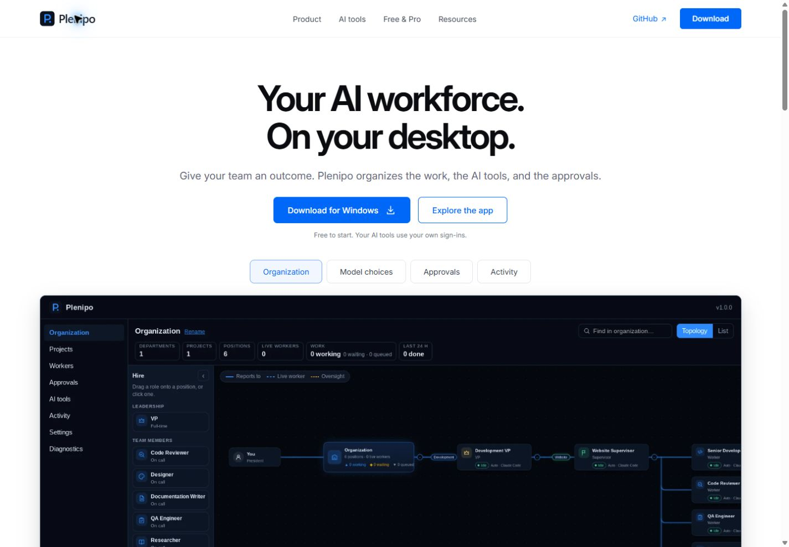
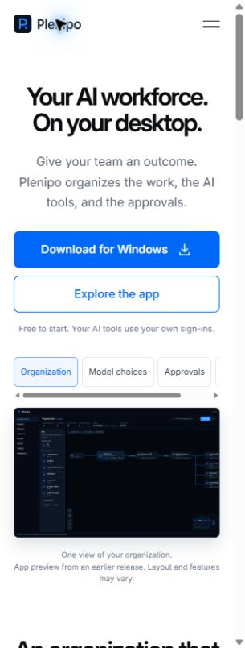

# Marketing website acceptance

The latest production correction opens the demo automatically. Its exact release, fresh public
browser checks, and cleanup are in the [automatic-entry receipt](website-releases/2026-09-28-autostart.md).
The click-entry measurements below remain historical; automatic-entry costs are recorded separately.

Production acceptance for the approved interactive homepage is recorded in the
[September 28 release receipt](website-releases/2026-09-28-interactive.md). It supersedes the
production-pending status of the historical implementation/preview checks below; their measured
performance limits and exact-source evidence remain applicable.

## Interactive homepage sample — September 28, 2026

The maintainers selected React Flow and approved the preview's design direction. This website-only
change adds six fictional organization cards, selectable objectives and conversations, sample
approval choices and activity, Pip tips, light/dark preview, list/map controls, and reset. No
AI runs or customer data is used. Production release is separately pending. Existing installer
metadata remains unchanged; the application source version is not an installer availability claim.

Review captures: [desktop light](../brand/website-evidence/interactive-desktop-light.png),
[desktop dark](../brand/website-evidence/interactive-desktop-dark.png), and
[phone](../brand/website-evidence/interactive-phone.png). These show authored sample content;
the maintainers' private desktop references are not included in the website or these captures.

### Source and checks

Main advanced during validation. The branch was reconciled against application v1.10.0 at
`c5d1a719cd5140029a433daddce74d0158a3bb57`, producing combined source
`606bbd90dd0825064e787f3ba3adaf43afc57b87`. Its transferred archive SHA-256 was
`43615446d8fe20d7d33cb54bdd7b42ef0adae4dd1822e3af147204ccea801096`.

All five repository-required commands passed on that combined source on Coastline:

- `pnpm check`: versions, formatting, lint, type checks, 304 UI tests, 263 desktop tests,
  2 website tests, and 9 script tests. Completed 09:21:32 UTC.
- `cargo fmt --all -- --check` and strict workspace/all-target clippy: passed.
- `cargo test --workspace --locked`: 1,056 passed, none failed or ignored.
- `pnpm bindings`: 241 export tests passed; the complete generated-file names and SHA-256
  hashes were identical before and after. Rust/binding checks completed 09:32:19 UTC.

The later `4dbc4148316fd7dd0dbc861bc6b522e3d950f2cb` change repairs retry after a browser caches
a failed module import and adds factual documentation and screenshots. It changes no Rust,
desktop, type-generation, or dependency source. Full `pnpm check` passed again at that exact source
at 09:34:58 UTC with the same test counts, followed by a successful standalone `npm ci` image build.
Existing desktop test-environment canvas/React act warnings were non-fatal. The earlier checks
alone do not establish retry acceptance.

The final browser failure test blocked the hashed demo module, verified readable fallback and an
enabled retry, restored loading, and successfully mounted the same module with `?retry=1`.
The successful request transferred 156,660 bytes including response headers. Returning to the
static sample and a fresh ordinary first load also passed with no normal-run console warnings or
errors. Temporary network, CPU, media, touch, and viewport emulation are restored after QA.

The healthy isolated preview identifies source `4dbc4148316fd7dd0dbc861bc6b522e3d950f2cb`, image
`sha256:b5c0de67fcb1a6d91037086e4a097c818d8e179772e8dc887a0e61ec4aa02e99`, and website-input
manifest digest `daef4a56cd7c8780bdf67b6c318299498caf3928a86ddc9431907c881e1810f0`.
It had zero restarts, healthy HTTP checks, and a 404 for a missing route. The receipt's older
overlay archive field is historical; use the source identity and website-input manifest for this
revision. Only acceptance/checklist documentation follows that tested website source, receiving
focused formatting and link checks. The PR is handed to the coordinator for review and normal merge.

A final fetch found documentation-only main advance `65d6632b06cc1cb2fffe539cfb072eb4f0808bb6`
(phase-18 design records). It merged cleanly as `149e6c30baf7d1c5c78874000db71b6e9e26615b`.
Website, application, dependencies, and bindings remained byte-identical to their tested sources;
the combined documentation received fresh formatting and link checks. This factual receipt is
the only subsequent edit.

The source uses frozen pnpm installation for repository checks and standalone `npm ci` for the
website Docker build. Both lockfiles are intentional: the existing Docker context contains only
`apps/website`. The production image retains its non-root, read-only runtime and security headers.

### Browser and performance evidence

Chromium checks covered 1440 px desktop and 390/320 px phone widths, with independent coordinator
inspection at 1265 px. Cards, reporting edges, dragging, keyboard selection/movement, pan/zoom/fit,
story tabs, conversation selection, both sample decisions, activity, reset, theme, Pip tips,
static return, and phone touch selection were exercised. Phone list view is the default; no
horizontal page overflow was observed. Workflow tab keyboard navigation, mobile menu Escape,
and FAQ expansion remained functional. Reduced-motion emulation produced no active animations.
With JavaScript disabled, download links and the native expandable sample remained usable.
Normal interaction runs had no browser warning/error entries; deliberate blocked-resource errors
are retained separately. This is Chromium coverage, not a claim of every browser or real device.

No demo JS/CSS transfers before explicit activation. The measured demo JavaScript is 156,360 bytes
gzip (421,935 decoded), CSS 6,291 bytes gzip, and the initial Pip image 13,092 bytes. The five new
Pip exports total 66,406 bytes. Build tests enforce 180,000-byte JS and 12,000-byte CSS gzip ceilings;
these are implementation guardrails, not the original research proposal's approved budget.

| Chromium phone measurement                                              | Activation | Long tasks         | Layout shift without recent input |
| ----------------------------------------------------------------------- | ---------- | ------------------ | --------------------------------- |
| Full cold run, 4x CPU slowdown, 1.6 Mbps download, 150 ms latency       | 2.930 s    | 63, 89, 57, 133 ms | 0.008704                          |
| Separate cache-bypassed, fonts-settled activation under the same limits | 1.119 s    | 84 ms              | 0                                 |

The second run isolates demo activation; it does not replace the first cold-page result.
The original native-module proposal's 80 KB JS and under-50 ms/zero-new-shift aspirations were
not all met after the maintainers selected React Flow. The explicit load button, readable static
fallback, phone list default, and local-only sample bound this tradeoff. These measurements
are observations from one emulated Chromium environment, not a performance guarantee.

### Test history and resources

Earlier runs are not combined into a false final pass: initial type declarations/event typing
and an npm lock generated beside pnpm symlinks were corrected; a formatter initially scanned a
task-local package cache; a 1 GiB container hit Node's automatic heap limit; the archived source
needed a Git index for repository documentation checks. Cache placement, a 2 GiB container with
explicit heap limit, a clean standalone npm lock, and a task-local index resolved those setup
failures. The old-base frontend pass had 304 UI and 240 desktop tests. Old-base Rust was deliberately
interrupted when main advanced; its log is not acceptance evidence. A separate earlier Rust setup
run was paused for host resource pressure. The host backup and unrelated applications were preserved.

Evidence is retained outside the repo under the worker's `implementation` artifact directory and
`/srv/8west/testing/plenipo-interactive-01a0e6d4`: `frontend-reconciled.log`, `rust-reconciled.log`,
the later final-source log, `performance-phone.json`, `performance-demo-isolated.json`, and preview
receipts. Test containers are disposable, limited to 2 GiB/1 CPU with one Rust compile job and
serial tests, and use the shared heavy-check mutex. No desktop Docker was started.

The review preview uses Compose project `plenipo-interactive-01a0e6d4`, loopback port 14382,
network `10.204.231.0/28`, 64 MiB memory, and no application data volumes. Its reservation is
`/srv/8west/port-allocations/14382-plenipo-interactive-01a0e6d4.json`; updates hold the persistent
allocation mutex. The task-owned SSH forward exposes the same loopback port on the desktop.
Retain this requested review preview until handoff/review completes, then remove only this task's
preview, network, reservation, and forward. Keep persistent lock files. Production is unchanged.

## Pip branding update — September 27, 2026

The approved Plenipo logo now appears in the header/footer, with Pip in the welcome/download
areas and the four AI-provider illustrations. Existing sections, Inter page typography,
product screenshots, controls, pricing, and permission wording are retained. The narrow content
correction uses the published v1.6.0 installer and adds Kimi/Moonshot while keeping Ollama cloud
support. Release evidence is linked from [website operations](website.md).

Asset verification:

- All 47 original supplied files match their actual Git archive bytes. Two receipt files
  retain original CRLF bytes through exact `.gitattributes` entries; no global renormalization.
- Four new source PNGs preserve image-generation output bytes and have genuine alpha 0–255.
  All six website Pip exports are 480 × 480 alpha WebP images. The four new provider images
  total 138,784 bytes. The Moonshot portrait is fitted with padding, preserving its antenna/feet.
- Actual saved source proof sheets were inspected on white and navy. Approved light/dark
  horizontal and square logos, P-only favicons, and the website share card were also inspected.
- The downloadable ZIP opens without errors and matches every original and new asset byte for
  byte. SHA-256: `570efa09cd907640a18ada2c8b13075b56250ba9ffaa79544012da9519d33f90`.
  Versioned manifest/ZIP links prevent reuse of their previous one-hour browser cache entries.

Browser flow: load the page, inspect the branding, switch a product view, open/close mobile
navigation, follow AI tools/download links, and expand the FAQ. Unified computer-use's in-app
browser supplied the Playwright controls; the separate Browser plugin is not installed.

| Check                 | Result                                                                         |
| --------------------- | ------------------------------------------------------------------------------ |
| Page identity/content | Correct title, heading, four labeled providers, no blank screen/error overlay  |
| Desktop/phone layout  | 1440, 900, 390, and 320 px; no horizontal page overflow                        |
| Mascots               | Complete artwork, transparent edges, all visible images loaded                 |
| Controls              | Product tab click/Home key, menu selection/Escape close, FAQ expansion passed  |
| Console               | No warning/error entries in tested page                                        |
| HTTP                  | 18 origin paths passed; served asset bytes matched; missing route returned 404 |
| Installer             | Published v1.6.0 asset resolved to final HTTP 200                              |

Actual saved captures are retained with the task's validation evidence: `preview-desktop.png`,
`preview-providers-desktop.png`, `preview-mobile-390.png`, and provider views at 390/320 px.
For durable PR review, exact copies of the inspected [before](../brand/website-evidence/pip-before-desktop.png),
[after](../brand/website-evidence/pip-after-desktop.png),
[provider section](../brand/website-evidence/pip-providers-desktop.png), and
[phone](../brand/website-evidence/pip-mobile.png) captures are included in the repository.
The approved artwork matches the references; website exports reduce resolution for page weight,
and decorative provider images use empty alt text because adjacent labels identify each tool.
Browser scope is Chromium at the tested sizes; this does not claim testing in every browser.

The initial five repository-required commands passed on the isolated Coastline source copy:
`pnpm check` (240 UI tests, 175 desktop tests, 2 website tests, plus versions/format/lint/types),
`cargo fmt --all -- --check`, `cargo clippy --workspace --all-targets --locked -- -D warnings`,
`cargo test --workspace --locked` (765 passed, none failed/ignored), and `pnpm bindings`
(189 export checks; the complete generated-file list and byte hashes stayed unchanged).
That initial Rust/application tree matched base `eb49e9f`; the imported branding source was checked at
`1088f62` with the final manifest/ZIP cache links. Later receipt/evidence-only additions receive
focused formatting/build verification. Final merge/release identity belongs in the deployment
receipt.

After the browser changes and GitHub presentation work merged into main `ebe55f9`, this branch
was reconciled as `4b4e246695ed599ef927f6d0d1a3fd5bf9d3ed48`. All 1,183 files from its source
archive were verified after transfer. Archive SHA-256:
`d168a93628ee408700555a3fcb2a3c14aaa190b32f08716a24775bd7aabf9dfe`.
All five required commands passed again on that combined source at 15:30:57 UTC on September 27:
240 UI, 175 desktop, 2 website, 767 Rust, and 189 binding-export tests, with no failed or ignored
Rust tests and no generated-file name or byte changes. This includes all 18 synthetic browser
tests. Branding assets, website source, and the reviewed layout are unchanged from `8e9c40e`;
the branch adds no desktop or Rust edits beyond merged main. Only this factual receipt follows
the tested source, with focused formatting and website-build verification before pushing.

Checks used a 2 GiB/2 CPU container with one compilation job and serial Rust tests. Debian
Chromium was installed in that container for the repository's synthetic browser tests. The
preview used a separate Coastline task directory and a 64 MiB container. No desktop Docker,
other application data, app source, or GitHub repository settings were changed.
The completed preview, network, port reservation, SSH forward, and test containers were removed;
the persistent shared lock files were retained. Publishing remains pending until the coordinator
hands off the approved merged revision and the actual origin/public release passes verification.

## Original website delivery

Validated on September 27, 2026, against desktop base `a3439987d803f04a2e323c1cceb151bf00e695b4`.
This change adds the website without modifying desktop source, its manifests, or generated bindings.
Container checks ran on Coastline in isolated task directories; no desktop Docker was used.

After PR #27 documented planned Pro pricing and PR #29 merged, the two pricing statements were
reconciled against main `189e6d61c5fbbf6cc217b5cb31666d6bf021dd3b`. Planned Pro is $9/month or
$99/year; v1.4.0 remains free and unrestricted. This follow-up changes website copy only.
The follow-up passed `pnpm check` in a disposable 1 GiB/1 CPU Coastline container, the two website
build/metadata tests, image health, and browser pricing/FAQ checks with no 320 px page overflow
or console errors. The completed original desktop CI also passed; desktop code, configuration,
lockfiles, and bindings are unchanged by the pricing reconciliation.

## Checks

- `pnpm check`: passed versions, formatting, lint, workspace type checks, 157 desktop tests,
  and 2 website build/metadata tests. Existing React test `act(...)` warnings were non-fatal.
- `cargo fmt --all -- --check`: passed.
- `cargo clippy --workspace --all-targets --locked -- -D warnings`: passed.
- `cargo test --workspace --locked`: 674 passed, none ignored.
- `pnpm bindings`: 168 export checks passed; generated files had no diff.
- Website production image: built successfully; non-root/read-only Compose container became healthy.
- Origin: home, CSS, JavaScript, brand/media assets, health, manifest, and sitemap available;
  an unknown path returned HTTP 404. Published Windows installer resolved to HTTP 200.
- Browser: desktop 1440 px, mobile 390 px and 320 px checked. No horizontal page overflow at 320 px
  after repairing the tab rail. Arrow/Home/End keys selected tabs; mobile navigation opened,
  closed on selection and Escape; FAQ expanded; in-page links reached their sections.
- Browser console: no warning/error entries in the tested page. Self-hosted Inter loaded.
- A stale stylesheet observed during iteration led to content-derived CSS/JS query hashes in
  the build. Tests verify those hashes and every local destination/asset. Final focused tests,
  lint and formatting passed after the visual fixes.
- Release freshness: the published Windows installer changed to v1.4.0 during review. Both
  download links, visible versions, structured metadata, and generated release metadata now agree;
  the v1.4.0 installer resolved to HTTP 200. Focused website tests, lint, formatting, container
  health, and browser version/download/FAQ checks passed after this update. Approval wording
  reflects the release's optional settings, which start off, for allowed websites.

The Rust validation container was capped at 2 GiB/2 CPUs with one compilation job; frontend checks
ran in a 1 GiB container. Both were removed after checks. Each temporary website preview
uses a 64 MiB limit and is retired after its acceptance checks. Host backup and unrelated apps
were preserved. Exact merged revision, image and public acceptance belong in the deployment
receipt; a preview test is not proof that the public hostname is live.

## Visual comparison

The generated concept and actual browser captures were viewed together during review. The
following five design anchors match the selected direction:

| Anchor                            | Browser result                                                                    |
| --------------------------------- | --------------------------------------------------------------------------------- |
| White canvas and restrained color | White background, dark text, blue actions, pale gray feature panel                |
| Compact navigation                | One consistent Plenipo/Product/AI tools/Free & Pro/Resources header               |
| Hero hierarchy                    | Centered two-line headline, paired primary/secondary actions, broad product media |
| Product exploration               | Pill-style preview tabs and an underlined workflow tab rail                       |
| Lower-page structure              | Open AI-tool row, split text/media, planned edition table, quiet footer           |

Intentional adaptations: actual app captures replace generated app mockups; the existing vector
P replaces the concept's approximate mark; the screenshot tab says Model choices to describe its
real view; provider names use typography; both editions are explicitly Planned. Native responsive
layouts, keyboard behavior, version labeling, and disclosure controls replace static concept art.
This is a close visual interpretation of the reference, not a claim of pixel identity with ui.com.

Desktop evidence:

Small-screen evidence:

