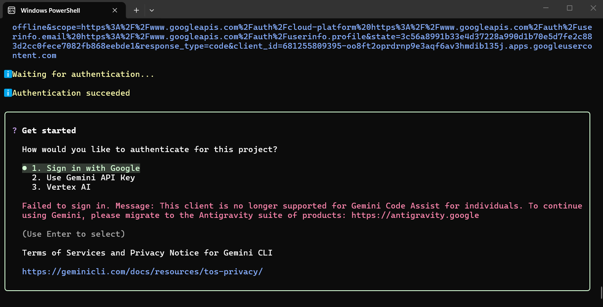

# Finding: Google's Gemini CLI can't be added — it no longer signs in with a personal Google plan

Plenipo does not add Gemini CLI as an AI tool. Since 2026-06-18, Google no longer serves Gemini
CLI to personal Google accounts: the free plan, Google AI Pro, and Google AI Ultra. On the
owner's PC, **Sign in with Google** was refused. Gemini CLI now runs only with a business Gemini
Code Assist license (Standard or Enterprise), a pay-per-use Gemini API key, or Vertex AI (Google
Cloud billing). The last two are refused by the bar, and the owner has no business license. As
ADR-014 §4 (adding AI tools) says, this branch merges this finding instead of an adapter.

Google's replacement for personal accounts is **Antigravity CLI** (`agy`). At the owner's
direction (2026-09-29), Plenipo checks it in Gemini CLI's place in Phase 16 Wave 1: see
[the Phase 16 checklist](phase-16-checklist.md) and Part E of
[the checks on the owner's PC](phase-16-owner-checks.md).

## Tool and version checked

- **Gemini CLI 0.61.0** (`npm install -g @google/gemini-cli`), on the owner's Windows PC,
  2026-09-29, in PowerShell 7.6.6; and the same version on Plenipo's Linux build machine, signed
  out, the same day ([evidence](evidence/phase-16/README.md)).
- **On Windows it is a Node.js program.** npm installed only `gemini`, `gemini.cmd`, and
  `gemini.ps1` in `%APPDATA%\npm`, with no `gemini.exe`, and `winget search --name "Gemini CLI"`
  found no package. Plenipo runs only real `.exe` files (the guide, §2), so an adapter would have
  had to start Node.js with Gemini's program.

## Bar item that failed

**ADR-014, bar item 3:**

> **Subscription sign-in only.** The owner signs in once with the tool's own login command and
> the subscription account. Pay-per-use API billing stays off. Plenipo never asks for, stores, or
> passes API keys or passwords.

Evidence:

- **On the owner's PC**, choosing **1. Sign in with Google**, and finishing in the browser
  ("Authentication succeeded"), ended with: "Failed to sign in. Message: This client is no longer
  supported for Gemini Code Assist for individuals. To continue using Gemini, please migrate to the
  Antigravity suite of products: https://antigravity.google". The only other choices offered were
  **2. Use Gemini API Key** and **3. Vertex AI**.

  

- **Google's own page** ([Gemini Code Assist consumer accounts](https://developers.google.com/gemini-code-assist/docs/deprecations/code-assist-individuals)):
  "Starting June 18, 2026, Gemini Code Assist IDE extensions stopped serving requests for the
  Gemini Code Assist for individuals, Google AI Pro, and Google AI Ultra tiers", which also applies
  to Gemini CLI; "access to Gemini Code Assist IDE extensions and Gemini CLI using Gemini Code
  Assist Standard or Enterprise subscriptions remain unchanged"; and consumer users "can migrate to
  the Antigravity family of products". Google's announcement:
  [Transitioning Gemini CLI to Antigravity CLI](https://developers.googleblog.com/an-important-update-transitioning-gemini-cli-to-antigravity-cli/).

Bar item 4 (a sign-in status check) was also open: Gemini CLI has no status command, and its ACP
`/about` reports the saved sign-in method but said nothing about a key set in the environment
([evidence](evidence/phase-16/README.md)). With item 3 failing, it was not checked further.

## What would change the answer

- Google serving Gemini CLI to personal Google accounts again; or
- the owner getting a business **Gemini Code Assist Standard or Enterprise** license, which Google
  says still works with Gemini CLI. That would need its own check, because it runs through a Google
  Cloud project.

## Not done

- **A Gemini API key, or Vertex AI.** Pay-per-use and Google Cloud billing are refused by ADR-014
  (adding AI tools) and ADR-007 §4, and by ADR-036 (every AI model worth having) until Wave 3's
  spending caps. Vertex AI is a cloud reseller account, which ADR-036 §6 keeps out.
- **Signing Gemini CLI in with Antigravity's sign-in**, or copying one tool's saved sign-in into
  the other. That is an unofficial workaround (ADR-014 §7).
- **Gemini's models through Antigravity CLI** are not a workaround: Antigravity CLI is Google's own
  program for personal accounts, and it is checked against the same bar on its own.
